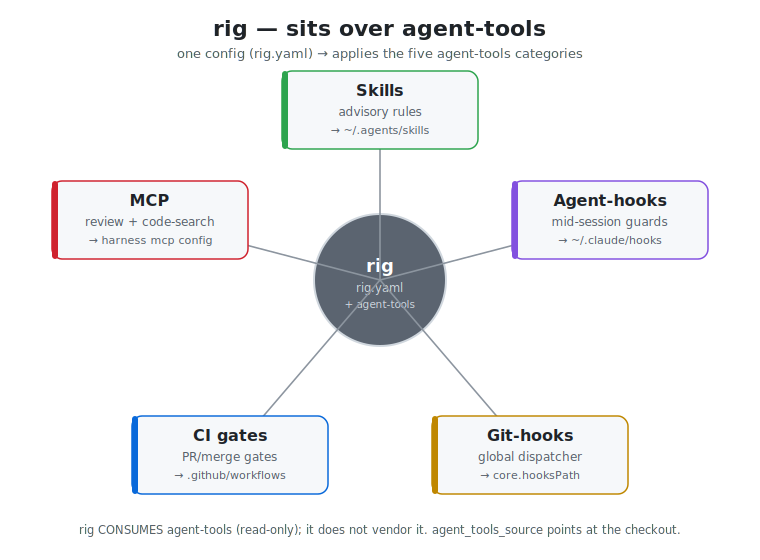
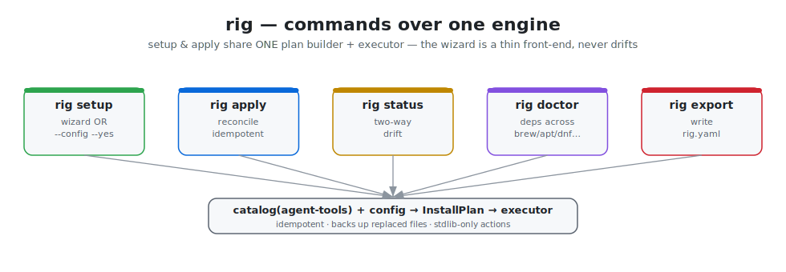
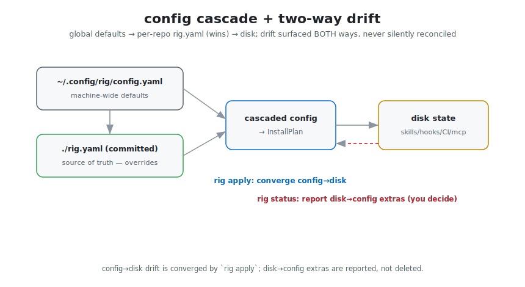

# rig

**The dev-environment umbrella driver.** `rig` sets up a repository (and a developer's
machine) from a committed, declarative `rig.yaml` by applying content from the
[`agent-tools`](https://github.com/alex-mextner/agent-tools) umbrella repo — skills,
agent-hooks, the global git-hook dispatcher, CI gates, and MCP registrations. One command
configures a repo's guardrails the same way, every time, on every machine.

`rig` is a peer to `tg-cli` and `review-cli`: a small standalone Python CLI (`bin/rig`
shim + a `riglib/` package), uv-runnable, stdlib-only at import time with heavy deps lazy.



## Why a separate tool

`agent-tools` is a *library* of portable rules and guards. It does not install itself.
`rig` is the installer/reconciler: it reads your `rig.yaml`, computes what should be on
disk, and converges to it — idempotently, with backups, surfacing drift both ways. The
config is the reproducible source of truth; `rig` is the engine that applies it.

```
agent-tools  =  WHAT (skills / hooks / CI gates / MCP — portable content)
rig          =  HOW  (read rig.yaml, apply it, reconcile, detect drift, bootstrap deps)
```

## Install

```bash
git clone https://github.com/alex-mextner/rig-cli
cd rig-cli && ./install.sh        # symlinks bin/rig into ~/.local/bin, registers the skill
```

Or run from a checkout without installing — `python3 bin/rig …` / `uv run bin/rig …`.

The interactive wizard needs `textual`:

```bash
pip install 'rig-cli[tui]'        # or: rig doctor --yes (installs missing deps)
```

## Commands



| Command | One-line |
| --- | --- |
| `rig setup` | Set up a repo from config — an interactive wizard, **or** headless `--config rig.yaml --yes`. Writes `rig.yaml` (committed by default), then applies. |
| `rig apply` | Declarative reconcile: read `rig.yaml`, compute the diff vs the repo's state, converge. Idempotent. `--dry-run` previews. `--only skills,ci` scopes. |
| `rig status` | Detect + report **drift in both directions** (config says X but disk has Y; disk has Z not in config). |
| `rig doctor` | Detect + (offer to) install every tool rig/agent-tools need, across brew / apt / dnf / pacman / zypper. `--yes` installs non-interactively. |
| `rig export` | Write a starter `rig.yaml` from detected defaults without a TUI. |
| `rig install-skill` | Register the `rig` agent skill so harnesses auto-discover it. |

### Quick start

```bash
rig doctor                                   # check deps; rig doctor --yes to install
rig export -o rig.yaml                        # write a starter config (edit it)
rig apply --dry-run                           # preview the resolved plan, write nothing
rig apply                                     # converge the repo to rig.yaml
rig status                                     # later: is the repo still in sync?
```

Headless / agent path (no TUI):

```bash
rig setup --config rig.yaml --yes             # first-run setup from a committed config
rig apply                                      # re-apply on every machine, identically
```

## Config — `rig.yaml`

**`rig.yaml` is committed by default.** It is the reproducible source of truth: commit it,
and `rig apply` reproduces the same install on any machine and in any agent session.

The config **cascades by location** (no scope flag):



1. **Global** — `~/.config/rig/config.yaml` (machine-wide defaults you carry across repos).
2. **Per-repo** — `./rig.yaml` (overrides the global layer; committed).

Dicts merge recursively (per-repo wins); lists/scalars replace wholesale. See
[`docs/config-schema.md`](docs/config-schema.md) for every key. A worked example is
[`rig.yaml`](./rig.yaml) at the repo root (this repo dogfoods its own config).

### Drift — surfaced both ways, never silently reconciled

`rig status` reports two directions:

- **config→disk** — declared in `rig.yaml` but missing/modified on disk. `rig apply`
  converges these.
- **disk→config** — installed on disk but not declared (orphan / hand-added). These are
  **reported, not deleted** — you decide whether to adopt them into the config or remove
  them.

## How rig consumes agent-tools (the integration seam)

`rig` never vendors agent-tools content. At runtime it locates an agent-tools checkout —
`agent_tools_source` in config, else `$RIG_AGENT_TOOLS_SOURCE`, else `~/xp/agent-tools` /
`~/work/agent-tools` / `~/agent-tools` — and **scans it live** into a catalog
(`riglib/catalog.py`):

| agent-tools path | becomes |
| --- | --- |
| `skills/universal/<name>/SKILL.md` | a `skills` item (group `universal`) |
| `skills/by-type/<kind>/<name>/SKILL.md` | a `skills` item (group `by-type/<kind>`) |
| `agent-hooks/<name>/<name>.<point>.json` | an `agent_hooks` item |
| `ci/<name>/{workflow.yml,*.sh}` | a `ci` item |
| `git-hooks/global-dispatcher/` | the `git_hooks` dispatcher item |
| `mcp/<name>/` | an `mcp` item |

The catalog drives config validation (unknown item names fail closed), the wizard's
description panes, and the install actions. Update agent-tools, and `rig` picks up new
items on the next scan — no code change in `rig`.

## Architecture

```
riglib/
  cli.py            argparse + subcommand dispatch (lazy imports)
  catalog.py        scan an agent-tools checkout → item registry  ← the integration seam
  config.py         cascade loader + fail-closed schema validation
  detect.py         env/project + OS/package-manager detection
  plan.py           (config + catalog) → ordered InstallPlan       ← shared by setup & apply
  drift.py          two-way drift detection
  doctor.py         dependency diagnosis + bootstrap across package managers
  state.py          SetupState ⇄ rig.yaml (the single serializer)
  install.py        install-skill (agent discovery)
  logging.py        opt-in JSONL structured logging (stdlib)
  actions/          stdlib-only install actions (the executor)
    runner.py         run_plan: copy_skill / install_agent_hook / install_dispatcher /
                      install_ci / register_mcp — idempotent, backup-noted
    fsutil.py         conflict-policy + idempotency + backup helpers
  tui/app.py        the textual wizard — a thin front-end over the same engine
```

`setup` and `apply` share **one** plan builder and **one** executor; the TUI just wraps
the executor with a progress view. One code path, two front-ends — the wizard can't drift
from `apply`.

## Development

```bash
uv venv && . .venv/bin/activate
uv pip install pytest pyyaml 'textual>=0.50'
python -m pytest -q          # unit suite
bash tests/smoke.sh          # end-to-end smoke (needs an agent-tools checkout)
python docs/gen_svgs.py      # regenerate the diagrams
```

## How rig compares

Most setup tools fall into three buckets. **Dotfile managers** (chezmoi, yadm) version a
*person's* config across machines — `~/.gitconfig`, shell rc, secrets. **Scaffolders**
(cookiecutter) stamp a project once from a template and walk away. **Config-as-code**
(Projen, Nix home-manager) regenerate managed files from a typed/declarative source and
keep them in sync.

`rig` is config-as-code, but aimed at a different target: **a repository's agent
guardrails** — skills, agent-hooks, the global git-hook dispatcher, CI gates, and MCP
registrations — sourced live from the [`agent-tools`](https://github.com/alex-mextner/agent-tools)
umbrella. It is **declarative + idempotent** (one `rig.yaml`, re-apply identically on any
machine), it **detects drift in both directions** (config→disk *and* orphan disk→config,
reported not silently overwritten), and it **bootstraps the dependencies** those guards
need across brew/apt/dnf/pacman/zypper.

| Tool | Target | Declarative config | Idempotent re-apply | Bidirectional drift | Agent skills / hooks / CI gates | Dep bootstrap |
|---|---|---|---|---|---|---|
| **rig** | a repo's agent guardrails | ✓ (`rig.yaml`) | ✓ | ✓ (both ways, reported) | ✓ | ✓ (multi-PM) |
| chezmoi | personal dotfiles | ✓ | ✓ | ~ (diff vs source) | — | — |
| yadm | personal dotfiles | ~ (git + alt files) | ✓ | ~ (git status) | — | — |
| cookiecutter | new project from template | — (prompts once) | — (one-shot) | — | — | — |
| Projen | project build/CI config | ✓ (typed JS) | ✓ (synth) | — (overwrites) | — | — |
| Nix home-manager | a user's whole env | ✓ (Nix) | ✓ | ~ (rebuild) | — | ✓ (Nix store) |

`~` = partial. Dotfile managers and home-manager are *per-user*; cookiecutter is *one-shot*;
Projen reconciles build config but overwrites rather than reporting drift and knows nothing
of agent skills/hooks. `rig` is the only one of these whose unit of work is a repo's
agent-facing guardrails — and the only one that surfaces hand-added orphans instead of
clobbering them.

## Ecosystem

Part of the [HyperIDE.ai](https://hyperide.ai) agent toolchain:

- **[tg-cli](https://github.com/alex-mextner/tg-cli)** — Telegram bridge for agents: push reports, two-way control, Q→buttons
- **[review-cli](https://github.com/alex-mextner/review-cli)** — multi-model read-only code review
- **[agent-tools](https://github.com/alex-mextner/agent-tools)** — the shared umbrella: portable agent skills, git/agent hooks, CI gates, and the `agenttools_log` lib that the other CLIs consume
- **[draw-cli](https://github.com/alex-mextner/draw-cli)** — text-to-image via Hugging Face
- **[3d-cli](https://github.com/alex-mextner/3d-cli)** — scriptable CLI for the full 3D FDM lifecycle: modeling, mesh repair, slicing, and print monitoring
- **[hyperide.ai](https://hyperide.ai)** — Figma replacement inside VS Code. Edit React components directly through AST/LSP without AI hallucinations, token waste, or context-window limits. Works for indie vibe-coding and for enterprise teams with split design/dev roles.

Each CLI registers a skill into your agent harnesses (`<tool> install-skill`) so agents know it exists — see Install.

## License

MIT — see [LICENSE](LICENSE).
