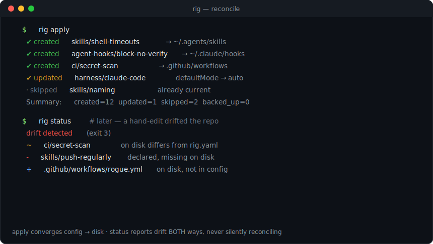

# rig

**One tool. One config. The whole dev culture of the coding-agent era — installed.**

`rig` is the single front door to an entire ecosystem of agent-native tooling. From one
committed, declarative `rig.yaml` it sets up a repository — and a developer's machine — wiring
in the **skills**, **agent-hooks**, global **git-hook dispatcher**, **CI gates**, and **MCP
servers** that keep a team's engineering discipline intact when most of the code is written by
agents. One command, the same guardrails, every time, on every machine.

In the coding-agent era the bottleneck isn't writing code — it's keeping a hundred parallel
agent sessions *on-culture*: tests first, secrets never committed, review before merge, an
auto-mode that's actually safe. `rig` installs and reconciles that culture from the portable
catalog in [`agent-tools`](https://github.com/alex-mextner/agent-tools) — the **WHAT** (the
content) to rig's **HOW** (apply it, reconcile it, prove it).

It's a peer to the rest of the ecosystem — [`tg-cli`](https://github.com/alex-mextner/tg-cli),
[`review-cli`](https://github.com/alex-mextner/review-cli),
[`draw-cli`](https://github.com/alex-mextner/draw-cli),
[`3d-cli`](https://github.com/alex-mextner/3d-cli),
[`task-cli`](https://github.com/alex-mextner/task-cli) — composable, agent-native CLIs that
share one config-and-skills backbone. `agent-tools` is the **WHAT** (portable skills, guards,
CI gates, MCP); `rig` is the **HOW** — it reads your `rig.yaml`, converges the repo and the
machine to it (idempotently, with backups), and surfaces drift in both directions.



## Install

**One-liner** (installs deps, links `rig` into PATH, registers the skill):

```bash
curl -fsSL https://raw.githubusercontent.com/alex-mextner/rig-cli/main/install.sh | bash
```

**Isolated env via pipx:**

```bash
pipx install git+https://github.com/alex-mextner/rig-cli              # adds the `rig` command
pipx install 'rig-cli[tui] @ git+https://github.com/alex-mextner/rig-cli'   # + interactive wizard
```

Or run straight from a checkout — `uv run bin/rig …` / `python3 bin/rig …`.

## Commands

| Command | One-line |
| --- | --- |
| `rig init` | **First-run onboarding.** Scaffold `rig.yaml` and wire in the agent-tools catalog — walking you through what's available (with opt-out). The front door for a repo/machine that has no config yet. |
| `rig apply` | **Declarative reconcile** (kubectl-style): read `rig.yaml`, compute the diff vs the repo's state, converge, idempotently. The steady-state command you re-run on every machine; hand-edits that drift from the config are surfaced by `rig status`. `--dry-run` previews; `--only skills,ci` scopes. |
| `rig status` | Detect + report **drift in both directions**, grouped by GLOBAL/REPO layer and by every area rig reconciles (skills, hooks, CI, MCP, symlinks, repo settings, auto-mode, tmux, model cron). |
| `rig doctor` | Detect + (offer to) install every tool rig/agent-tools need, across brew / apt / dnf / pacman / zypper. `--yes` installs non-interactively. |
| `rig export` | Write a starter `rig.yaml` from detected defaults without a TUI (recommends **auto-mode on**). |
| `rig setup` | **The interactive configuration wizard.** In a terminal it shows what is enabled across every reconciled area, lets you change any option (with an inline hint per option) in the local `rig.yaml` AND the global `~/.config/rig/config.yaml`, then applies. Non-interactive (piped / no TTY) it prints usage for `init`/`apply`/`config get\|set`. |
| `rig config get\|set` | **The headless counterpart to the wizard** — read/edit ONE nested key by **dot path**, then reconcile. `get <dot.path>` reads one key from the single target file (`./rig.yaml`, or `--global`); `--json` emits the raw value, a subtree prints as YAML. `set <dot.path> <value>` coerces the value conservatively (`true`/`false`/int/float/null; `09`/`1e3`/underscored/Unicode-digit values stay strings), writes it, then runs the **same apply engine** as `rig apply` (full rollback if the write or the catalog-backed plan build fails). `--global` targets `~/.config/rig/config.yaml`; `--no-apply` writes the key and prints the plan only. |
| `rig config-web` | **The web counterpart to the wizard** — a local browser UI to view + edit the reconciled config. Renders every area with its live effective value (the cascade of the global `~/.config/rig/config.yaml` + the repo `./rig.yaml`), tagged with the layer an edit lands in; a change routes to the **owning layer** and is written by the **same engine** as `rig config set`/the wizard (fail-closed validation, no `rig apply` — you reconcile explicitly). Lifecycle is the shared `agenttools-service` manager: `run` (foreground) / `start` (background daemon) / `status` / `stop` / `enable` (install launchd-macOS / systemd-`--user`-Linux autostart + start) / `disable`. Binds `127.0.0.1` only, with a same-origin (CSRF) + Host (DNS-rebinding) guard. A bare `rig config-web` prints help, never launches. `--port`, `-C <repo>`. **The lifecycle verbs need the `agenttools-service` lib** (an agent-tools nested lib, not on PyPI): `uv pip install -e <agent-tools>/lib/agenttools_daemon -e <agent-tools>/lib/agenttools_service`. Without it, `rig --help` and every other command still work; a lifecycle verb fails closed with that install hint. |
| `rig install-skill` | Register the `rig` agent skill so harnesses auto-discover it. |
| `rig stats show` | **Tool-adoption analytics.** Parse the session logs of every agent harness on the machine and report how often each tool is invoked, bucketed into baseline / ours / external-advertised / other — so you can see whether the rig + agent-tools ecosystem is actually being used vs the built-in baseline. `` `--format json|tui|web` ``, breakdowns by repo/harness, a daily trend (the `json` output additionally exposes the weekly series). |

### Quick start — `init` then `apply`

There are two commands, and they are **not** the same thing: `rig init` is first-run
onboarding (no config yet → scaffold one + wire the catalog in, walking you through it);
`rig apply` is the steady-state reconcile (config exists → converge the disk to it). You run
`init` once, `apply` forever after. `init` provisions **auto-mode** (the agent runs
autonomously with minimum babysitting) — recommended on by default, *and safe because the
agent-hook guards are installed alongside it.*

**Interactivity is orthogonal to the command.** Both `init` and `apply` run fully
interactive (TUI wizard), semi-interactive (some answers pre-supplied by config/flags, the
rest prompted), or non-interactive (`--yes` / `--config … --yes`). The mode is decided by
TTY + config + flags, *not* by which command you picked.

```bash
rig doctor                                    # check deps; rig doctor --yes to install
rig init                                       # first-run onboarding: scaffold rig.yaml + wire the catalog
rig apply                                      # steady state: re-apply on every machine, identically
rig status                                     # later: has the repo drifted from rig.yaml?
rig setup                                      # interactive wizard: see + change every area, then apply
```

To edit the config before applying: `rig export -o rig.yaml`, tweak it, then `rig apply`.

**`rig setup` — the interactive config wizard.** In a terminal it shows what is enabled across
every reconciled area (the `rig status` rows), lets you toggle/change any option in the local
`rig.yaml` AND the global `~/.config/rig/config.yaml` — each option with an inline hint of how
and why — then applies the change on the spot. Run from a non-TTY (a pipe/redirect) it prints
usage for the core commands instead of a half-wizard. For scripted single-value edits use its
headless counterpart `rig config get <dot.path>` / `rig config set <dot.path> <value>` — a
dot-path editor that reads/edits one nested key then reconciles (`--global` targets the global
config, `--no-apply` writes without converging).

Headless / agent path (no TUI):

```bash
rig init --yes                                 # first-run onboarding, non-interactive
rig apply                                      # re-apply identically on every machine
```

## `rig stats` — is the ecosystem actually being adopted?

`rig apply` installs the tooling; `rig stats` tells you whether anyone is *using* it. It
reads the on-disk session logs of every agent harness on the machine and counts how often
each tool is invoked, sorting every invocation into four buckets:

- **baseline** — the harness built-ins (`Bash`, `Read`, `Write`, `Edit`/`MultiEdit`,
  `Grep`, `Glob`, `NotebookEdit`, `Task`/`Agent`, `WebFetch`/`WebSearch`). The yardstick.
- **ours** — the agent-tools ecosystem: the CLIs `rig` / `review` / `tg` / `draw` / `3d` /
  `task` (detected **inside** a shell command — a `Bash` call running `review …` is pulled
  out of the baseline shell count and re-labelled `review (cli)`), our skills, and our
  `review` MCP.
- **external-advertised** — the third-party tooling we ship/recommend: MCP servers (serena,
  sverklo, context7, playwright, …) via the `mcp__<server>__<tool>` prefix, plus external
  skills (agent-browser, superpowers, h-*, debate-swarm, …).
- **other** — everything else.

```bash
rig stats show                                  # default: rich terminal UI (tui)
rig stats show --format json                    # canonical machine-readable data
rig stats show --format web                     # self-contained local HTML dashboard
rig stats show --since 2026-06-01 --until 2026-06-15   # window + period comparison
rig stats show --harness claude-code --repo /path/to/repo   # filter by harness / repo
```

**Harnesses parsed:** Claude Code (`~/.claude/projects/<enc>/<session>.jsonl` — the richest
source), Codex (`~/.codex/sessions/.../rollout-*.jsonl`), Gemini
(`~/.gemini/tmp/<hash>/chats/session-*.json`), and opencode
(`~/.local/share/opencode/storage/`). The supported-harness list is data-driven: each
parser self-registers, and a harness whose logs aren't on the machine is reported as
"not found" rather than failing. Adding a harness is one file in `riglib/stats/sources/`.

**Outputs:** `json` is the canonical shape every other renderer draws from; `tui` (default)
is a rich table-and-bar-chart report that degrades to plain text if `rich` isn't installed;
`web` serves a self-contained HTML page (inline SVG charts, no CDN, no JS deps) on a local
port (`--web-port`, default auto). All three break the counts down **by repo** and **by
harness** and render a **daily** trend; the `json` document additionally exposes the
**weekly** series. `--since` yields a before/after period comparison: the selected window
against the equally-long window immediately before it.

## Config — `rig.yaml`

**`rig.yaml` is committed by default.** It is the reproducible source of truth: commit it,
and `rig apply` reproduces the same install on any machine and in any agent session.

The config **cascades by location** (no scope flag):

1. **Global** — `~/.config/rig/config.yaml` (machine-wide defaults you carry across repos).
2. **Per-repo** — `./rig.yaml` (overrides the global layer; committed).

Dicts merge recursively (per-repo wins); lists/scalars replace wholesale. See
[`docs/config-schema.md`](docs/config-schema.md) for every key. A worked example is
[`rig.yaml`](./rig.yaml) at the repo root (this repo dogfoods its own config).

### Auto-mode — provisioned by the reconciler

A `harness:` block tells `rig apply` to write the agent harness's auto/permission setting,
so autonomy is part of the reproducible config — not a manual per-machine toggle:

```yaml
harness:
  enabled: true
  kind: claude-code          # skills-dir: claude-code|opencode · instruction-file: codex|gemini|pi|commandcode (config-schema.md)
  auto_mode: true            # RECOMMENDED: writes permissions.defaultMode=auto (user scope)
  hook_bridge: { enabled: true }   # wire the agents-hooks/v1 → CC dispatcher (default ON)
```

For **claude-code**, `auto_mode: true` writes `permissions.defaultMode=auto` to the **user**
settings (`~/.claude/settings.json`) — Claude Code honors `auto` only at user scope (it ignores
it in a repo's project settings), so auto-mode is a **per-machine** setting: declare the
`harness:` block in the **global** config (`~/.config/rig/config.yaml`), not per repo. `auto`
(a safety-classifier preview) auto-approves but a classifier blocks anything that escalates
beyond your request, touches unrecognized infrastructure, or looks prompt-injected — strictly
safer than `bypassPermissions` (which skips every check; pin `mode: bypassPermissions` to opt
into full bypass at project scope, e.g. inside a container). `rig apply` merges only that one
key (everything else is preserved), idempotently with a backup on conflict, and `rig status`
flags drift. Defense-in-depth: the agent-hook guards `rig` installs in the same pass
(`block-secrets-write`, `block-no-verify`, `enforce-timeout-on-bash`, `block-raw-process-env`,
**`block-raw-pr-merge`**) catch dangerous tool calls before the side effect, complementing the
classifier.

**Those guards only fire because of the hook bridge.** Claude Code runs hooks declared in
`settings.json`, not the `~/.claude/hooks/*.json` descriptors `agent_hooks` installs — so a
bridge is required to make the descriptors actually execute (agent-tools#18). The same
`harness` block therefore also registers the `cc_hook_bridge` dispatcher into `settings.json`
(`PreToolUse` for Bash + the file-edit tools, `Stop`), which runs the matching descriptors
and translates their exit-10 BLOCK into CC's `permissionDecision: "deny"`. Without it the
guards above would be inert files. Set `hook_bridge: { enabled: false }` to opt out. See
[`docs/config-schema.md`](docs/config-schema.md) for the full `harness` schema and the
opencode equivalent.

### Model-freshness schedule — a daily cron, provisioned by the reconciler

A `models:` block tells rig to provision a **daily cron that runs the agent-tools
model-freshness checker** (`lib/checker/model_freshness.py`) — which polls provider
model-list endpoints and proposes version bumps to the model board. On **`rig init` AND
`rig apply`**, rig checks whether the schedule is installed and installs it if missing
(idempotent):

```yaml
models:
  enabled: true
  schedule: { time: "12:00" }    # daily at noon (default)
```

Cross-platform: **macOS → launchd** (a `~/Library/LaunchAgents/ai.hyperide.model-freshness.plist`
loaded via `launchctl`), **Linux → crontab** (a sentinel-fenced managed line). `rig status`
reports whether the schedule is installed or drifted; `rig doctor` flags a missing scheduler
binary. See [`docs/config-schema.md`](docs/config-schema.md#models) for the full schema.

### Drift — surfaced both ways, never silently reconciled

`rig status` reports two directions:

- **config→disk** — declared in `rig.yaml` but missing/modified on disk. `rig apply`
  converges these.
- **disk→config** — installed on disk but not declared (orphan / hand-added). These are
  **reported, not deleted** — you decide whether to adopt them into the config or remove
  them.

The status headline is grouped by reconciled area under the GLOBAL machine-wide layer and, when
you are inside a git repository, the REPO layer from `./rig.yaml`. Outside a git repository,
`rig status` ignores any auto-discovered local `rig.yaml`, shows only GLOBAL areas, and prints
that the repo layer / `rig.yaml` is N/A; it does not tell you to commit a repo config where no
repo exists. An explicit `--config` can still declare GLOBAL areas in that mode, but repo-scoped
areas remain N/A until you run status inside a git repository.

## How rig consumes agent-tools (the integration seam)

`rig` never vendors agent-tools content. At runtime it locates an agent-tools checkout —
`agent_tools_source` in config, else `$RIG_AGENT_TOOLS_SOURCE`, else `~/xp/agent-tools` /
`~/work/agent-tools` / `~/agent-tools` — and **scans it live** into a catalog
(`riglib/catalog.py`):

| agent-tools path | becomes |
| --- | --- |
| `skills/universal/<name>/SKILL.md` | a `skills` item (group `universal`) |
| `skills/by-type/<kind>/<name>/SKILL.md` | a `skills` item (group `by-type/<kind>`) |
| `agent-hooks/<name>/<name>.<point>.json` | an `agent_hooks` item |
| `ci/<name>/{workflow.yml,*.sh}` | a `ci` item |
| `git-hooks/global-dispatcher/` | the `git_hooks` dispatcher item |
| `mcp/<name>/` | an `mcp` item |

The catalog drives config validation (unknown item names fail closed), the wizard's
description panes, and the install actions. Update agent-tools, and `rig` picks up new
items on the next scan — no code change in `rig`.

### Universal skills vs. a project's `AGENTS.md`

`rig` is the **universal skill layer**. Cross-project, always-apply MANDATORY skills (for
example `visual-proof-cycle` or `task-completion-selfcheck`) are provisioned by `rig` from
the agent-tools catalog and meant to reach **every project and every user** through the
SessionStart blurb, the rig-installed skills, and each skill's own trigger `description`.
That layer is their single source of truth.

A project's `AGENTS.md` (or a repo-level `CLAUDE.md`) is for **project-specific guidance
only** — how *this* repo builds, its layout, its local conventions. **Never duplicate a
universal mandatory skill into an individual `AGENTS.md`:** it pins a stale copy to one repo,
hides the real source, and goes stale the moment the skill changes. The universal layer is
the one place that carries these mandates — let it, and keep `AGENTS.md` project-specific.

## Architecture

```
riglib/
  cli.py            argparse + subcommand dispatch (lazy imports)
  catalog.py        scan an agent-tools checkout → item registry  ← the integration seam
  config.py         cascade loader + fail-closed schema validation
  detect.py         env/project + OS/package-manager detection
  plan.py           (config + catalog) → ordered InstallPlan       ← shared by init & apply
  schedule.py       pure planning of the model-freshness cron artifact (launchd/crontab)
  drift.py          two-way drift detection
  doctor.py         dependency diagnosis + bootstrap across package managers
  state.py          SetupState ⇄ rig.yaml (the single serializer)
  install.py        install-skill (agent discovery)
  logging.py        opt-in JSONL structured logging (stdlib)
  actions/          stdlib-only install actions (the executor)
    runner.py         run_plan: copy_skill / install_agent_hook / install_dispatcher /
                      install_ci / register_mcp / apply_harness / provision_schedule —
                      idempotent, backup-noted
    fsutil.py         conflict-policy + idempotency + backup helpers
  stats/            tool-adoption analytics (`rig stats show`) — a 3-stage pipeline
    sources/          one pluggable parser per harness (@register); CC / codex / gemini /
                      opencode → a normalized ToolInvocation stream
    taxonomy.py       the data-driven baseline / ours / external-advertised / other rules
    aggregate.py      pure reductions → counts / breakdowns / day+week trend series
    render/           json (canonical) / tui (rich, lazy) / web (http.server + inline SVG)
  tui/app.py        the textual wizard — a thin front-end over the same engine
```

`setup` and `apply` share **one** plan builder and **one** executor; the TUI just wraps
the executor with a progress view. One code path, two front-ends — the wizard can't drift
from `apply`.

## Development

```bash
uv venv && . .venv/bin/activate
uv pip install pytest pyyaml 'textual>=0.50'
python -m pytest -q                     # unit suite
bash tests/smoke.sh                     # end-to-end smoke (needs an agent-tools checkout)
bash tests/smoke.sh --fast              # the seconds-cheap pre-commit subset
scripts/install-smoke-precommit.sh      # wire the fast smoke into .git/hooks (once per clone)
python docs/gen_svgs.py                 # regenerate the diagrams
```

Run `scripts/install-smoke-precommit.sh` once after cloning to gate your commits on the fast
smoke locally — a commit that breaks the real `rig status` flow is then blocked before push,
not just in CI.

## How rig compares

Most setup tools fall into three buckets. **Dotfile managers** (chezmoi, yadm) version a
*person's* config across machines — `~/.gitconfig`, shell rc, secrets. **Scaffolders**
(cookiecutter) stamp a project once from a template and walk away. **Config-as-code**
(Projen, Nix home-manager) regenerate managed files from a typed/declarative source and
keep them in sync.

`rig` is config-as-code, but aimed at a different target: **a repository's agent
guardrails** — skills, agent-hooks, the global git-hook dispatcher, CI gates, and MCP
registrations — sourced live from the [`agent-tools`](https://github.com/alex-mextner/agent-tools)
umbrella. It is **declarative + idempotent** (one `rig.yaml`, re-apply identically on any
machine), it **detects drift in both directions** (config→disk *and* orphan disk→config,
reported not silently overwritten), and it **bootstraps the dependencies** those guards
need across brew/apt/dnf/pacman/zypper.

| Tool | Target | Declarative config | Idempotent re-apply | Bidirectional drift | Agent skills / hooks / CI gates | Dep bootstrap |
|---|---|---|---|---|---|---|
| **rig** | a repo's agent guardrails | ✓ (`rig.yaml`) | ✓ | ✓ (both ways, reported) | ✓ | ✓ (multi-PM) |
| chezmoi | personal dotfiles | ✓ | ✓ | ~ (diff vs source) | — | — |
| yadm | personal dotfiles | ~ (git + alt files) | ✓ | ~ (git status) | — | — |
| cookiecutter | new project from template | — (prompts once) | — (one-shot) | — | — | — |
| Projen | project build/CI config | ✓ (typed JS) | ✓ (synth) | — (overwrites) | — | — |
| Nix home-manager | a user's whole env | ✓ (Nix) | ✓ | ~ (rebuild) | — | ✓ (Nix store) |

`~` = partial. Dotfile managers and home-manager are *per-user*; cookiecutter is *one-shot*;
Projen reconciles build config but overwrites rather than reporting drift and knows nothing
of agent skills/hooks. `rig` is the only one of these whose unit of work is a repo's
agent-facing guardrails — and the only one that surfaces hand-added orphans instead of
clobbering them.

## Ecosystem

Part of the [HyperIDE.ai](https://hyperide.ai) agent toolchain:

- **[tg-cli](https://github.com/alex-mextner/tg-cli)** — simple Telegram CLI to send messages, photos & files, and a two-way agent bridge (reports, Q→buttons, voice/rich)
- **[review-cli](https://github.com/alex-mextner/review-cli)** — multi-model read-only code review from one command: diff review, cited quorum, brainstorm, visual review, and interactive spec-review tooling. Read-only, CLI-first, harness-agnostic.
- **[agent-tools](https://github.com/alex-mextner/agent-tools)** — the shared catalog `rig` applies: portable agent skills, agent-hooks, the global git-hook dispatcher, CI gates, and MCP servers
- **[draw-cli](https://github.com/alex-mextner/draw-cli)** — text-to-image via Hugging Face
- **[3d-cli](https://github.com/alex-mextner/3d-cli)** — scriptable CLI for the full 3D FDM lifecycle: modeling, mesh repair, slicing, and print monitoring
- **[task-cli](https://github.com/alex-mextner/task-cli)** — enforced ticket-system CLI for agents (GitHub Issues / Linear): acceptance criteria, motivation, and user-impact gates before work starts
- **[hyperide.ai](https://hyperide.ai)** — Figma replacement inside VS Code. Edit React components directly through AST/LSP without AI hallucinations, token waste, or context-window limits. Works for indie vibe-coding and for enterprise teams with split design/dev roles.

Each CLI registers a skill into your agent harnesses (`<tool> install-skill`) so agents know it exists — see Install.

## License

MIT — see [LICENSE](LICENSE).
